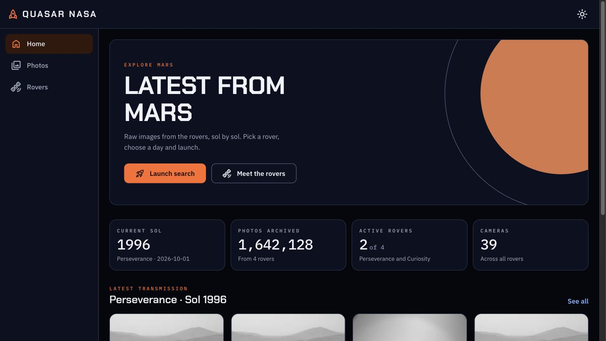
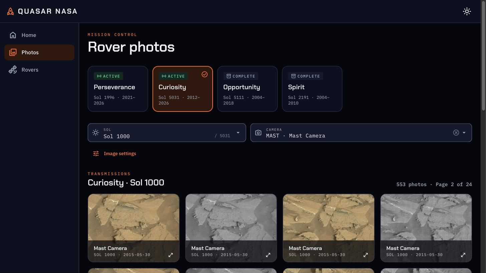
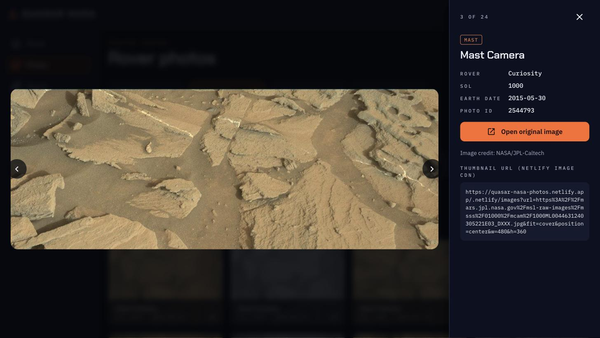
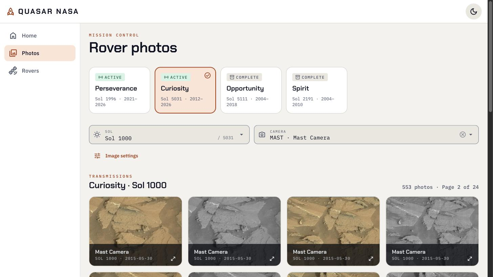
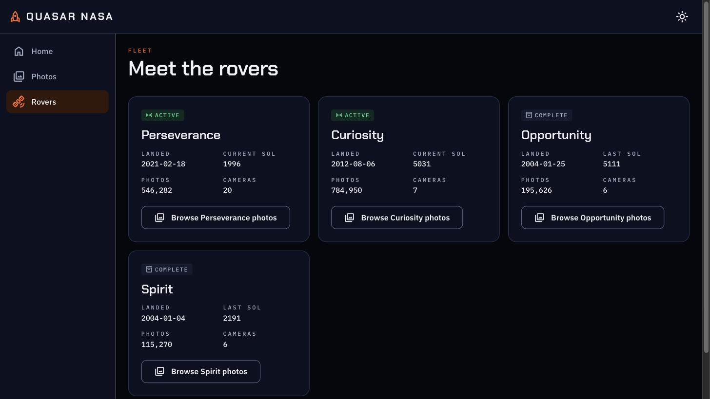
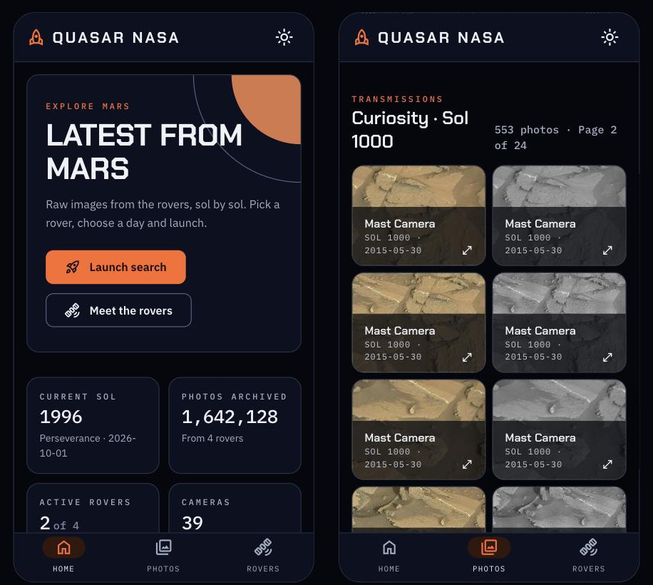

<div align="center">

# 🚀 Quasar NASA

**Browse every raw photo the Mars rovers have sent home, one sol at a time.**

[**Live demo →**](https://quasar-nasa-photos.netlify.app)


[](LICENSE)



</div>

---

Quasar NASA is a mission-control style explorer for photos taken by **Perseverance, Curiosity, Opportunity and Spirit**. That's more than **1.6 million images**, from the first sol in 2004 to the latest downlink.

Pick a rover, choose a sol (a Martian day) and a camera, and browse what the rover saw. Every thumbnail is resized on the fly by the Netlify Image CDN. Every photo opens at full resolution, with its telemetry.

## Features

- **All four rovers.** Active missions (Perseverance, Curiosity) and completed ones (Opportunity, Spirit), each with its status, landing date, sol count and photo totals.
- **Mission dashboard.** The home page shows live stats (current sol, photos archived, active rovers, cameras) and the latest transmission from the most recently active rover.
- **Sol and camera filters.** Type a sol number to jump straight to it. Each sol only lists the cameras that actually took photos that day.
- **Shareable searches.** Rover, sol, camera and page live in the URL, so any search can be bookmarked or shared, and back/forward navigation works.
- **Full-screen viewer.** Opens the original image with rover, sol, Earth date, camera and photo ID. Move between photos with the arrow keys.
- **On-the-fly thumbnails.** Choose width, height, fit, position, format (AVIF, WebP, JPG, PNG) and quality, and the Netlify Image CDN re-encodes every thumbnail live.
- **Two themes.** *Deep Space* (dark, the default) and *Lunar* (light), remembered per browser.
- **Mobile first.** Bottom navigation and a 2-column grid on phones, a sidebar on desktop.
- **Installable PWA.** Add it to your home screen. When a new version ships, the app prompts you to reload.
- **Accessible.** Keyboard-navigable rover picker (arrow keys), visible focus rings, reduced-motion support, and status shown as icon + word, never color alone.

## Screenshots

<table>
  <tr>
    <td width="50%"><br><sub><b>Mission control.</b> Rover picker, sol and camera filters, photo grid.</sub></td>
    <td width="50%"><br><sub><b>Viewer.</b> Full-resolution image with its telemetry.</sub></td>
  </tr>
  <tr>
    <td width="50%"><br><sub><b>Lunar theme.</b> The same screens in light mode.</sub></td>
    <td width="50%"><br><sub><b>The fleet.</b> Status, landing date, sols and photo counts for each rover.</sub></td>
  </tr>
</table>

<div align="center">
  <br>
  <sub><b>On mobile.</b> Bottom navigation and a 2-column grid.</sub>
</div>

## Tech stack

| | |
| --- | --- |
| Framework | [Quasar](https://v1.quasar.dev) v1 (Vue 2, Options API), built with `@quasar/app` (webpack) |
| Data | [Mars Vista API](https://api.marsvista.dev/swagger/index.html): open source drop-in replacement for the archived NASA Mars Rover Photos API |
| Images | [Netlify Image CDN](https://docs.netlify.com/image-cdn/overview/) for on-the-fly resizing and format conversion |
| HTTP | axios |
| Offline / install | Workbox (`GenerateSW`) service worker + web manifest |
| Design | Custom "Quasar NASA" design system: CSS tokens and `qn-*` components; Chakra Petch, IBM Plex Sans and IBM Plex Mono; Material Symbols |
| Hosting | Netlify |

## Getting started

### Prerequisites

- **Node.js 18 or newer** (tested on Node 24)
- **Yarn 1**
- A **Mars Vista API key**. Sign in at [marsvista.dev](https://marsvista.dev) and copy it from the dashboard.

### Setup

```bash
git clone https://github.com/patrickmonteiro/quasar-nasa-photos.git
cd quasar-nasa-photos
yarn

cp .env.example .env
# then edit .env and set MARSVISTA_API_KEY=<your key>

yarn dev
```

The app opens at **http://localhost:8080**.

### Scripts

| Command | What it does |
| --- | --- |
| `yarn dev` | Dev server with hot reload, in PWA mode |
| `yarn build` | Production build to `dist/pwa` |
| `yarn lint` | ESLint over `.js` and `.vue` files (also runs during dev and build) |

> [!IMPORTANT]
> Use the `yarn` scripts instead of calling `quasar dev` / `quasar build` directly. The scripts set `NODE_OPTIONS=--openssl-legacy-provider`, which webpack 4 needs on Node 17+. Without it the build fails with `error:0308010C:digital envelope routines::unsupported`.

> [!TIP]
> Dev also runs a service worker. If a change doesn't show up in the browser, unregister the worker in DevTools → Application → Service workers and reload.

## How it works

```
src/
├── boot/
│   ├── axios.js          # Mars Vista client (base URL + X-API-Key header)
│   └── theme.js          # Deep Space / Lunar theme switching
├── services/
│   └── marsvista.js      # getRovers, getManifest, getPhotos, getLatestPhotos
├── utils/
│   ├── image-cdn.js      # builds Netlify Image CDN URLs
│   └── format.js
├── components/           # PhotoCard, PhotoViewer, RoverBadge
├── pages/                # Index (home), Photos, Rovers, Error404
├── layouts/MainLayout.vue  # app bar, drawer, bottom nav
└── css/
    ├── qn-tokens.css     # design tokens for both themes
    ├── qn-components.css # qn-* component styles
    └── app.css           # Quasar adapters + layout
```

- **Data flow.** The Photos page loads the rover's *manifest* (every sol that has photos, with its cameras and counts), then requests one page of photos for the selected sol and camera. The rover list is fetched once and shared between pages.
- **API key.** `MARSVISTA_API_KEY` is read from `.env` at build time and sent as the `X-API-Key` header. Because this is a client-side app, the key ends up in the browser bundle. Use a key meant for public client use, or put a serverless proxy in front of the API.
- **Thumbnails.** Rover image URLs are wrapped as `/.netlify/images?url=…&w=…&h=…&fm=…`. Netlify only fetches from hosts allow-listed under `[images]` in `netlify.toml` (`mars.nasa.gov`, `mars.jpl.nasa.gov`, `planetarydata.jpl.nasa.gov`). If the CDN can't serve an image, the card falls back to the original.

## Deploying to Netlify

Everything Netlify needs is in [`netlify.toml`](netlify.toml): build command, publish directory, the service worker cache header and the image CDN allow-list.

1. Create a new Netlify site from this repository.
2. Under **Site configuration → Environment variables**, add `MARSVISTA_API_KEY`.
3. Deploy. `netlify.toml` overrides any build settings entered in the Netlify UI.

## Credits

- Photo data: the open source [Mars Vista API](https://marsvista.dev).
- Images: NASA/JPL-Caltech.
- Built with [Quasar Framework](https://quasar.dev).

This is an independent fan project. It is not affiliated with or endorsed by NASA or JPL.

## License

The code is released under the [MIT License](LICENSE). Rover images are provided by NASA/JPL-Caltech and are not covered by this license.
